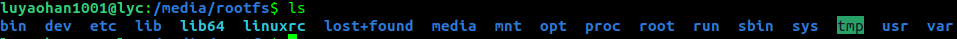

## Linux kernel development with QEMU emulator -- Hello World kernel module.

#### Start hacking by

	$ ./start_hack_linux.sh

	Login: root
	Password: 123123

#### The helloworld.c kernel module.

	Source for helloworld kernel module was created in helloworld.c as following.

	Then the Makefile was edited in kernel/drivers/char/ to include the helloworld object target.

	Then the Kconfig was also edited in kernel/drivers/char/ to include the CONFIG_HELLO_WORLD_MODULE option:

	After this change, we select this helloworld module in menuconfig.

	This target is configurable through Kconfig ($ make menuconfig) on the CONFIG_HELLO_WORLD_MODULE variable.

	Save the .config.

	Now, compile the module to generate kernel object, helloworld.ko.

	$ cd kernel/drivers/char

	$ make helloworld.ko

#### Testing this kernel module.

	(!) The filesystem image originaly located in buildroot-2022.02.8/output/images/rootfs.ext2 is now copied to filesystem/rootfs.ext2.

	The rootfs.ext2 needs to be mounted first so that the compiled helloworld.ko can be copied it.

	Create a mountpoint by

	$ cd /media

	$ sudo mkdir rootfs

	$ sudo mount filesystem/rootfs.ext2 /media/rootfs

	Now in /media/rootfs is the rootfs shown as a folder instead of a ext2 file.

	Create the a modules folder in /lib if there is none.

	/lib/modules is where modprobe by default looks for kernel modules.

	$ mkdir -p /lib/modules/5.15.0 (current linux version.)

	And copy the compiled helloworld.ko to this folder.

	$ cp kernel/drivers/char/helloworld.ko /lib/modules/5.15.0

#### Demo for loading the helloworld kernel module on QEMU.

	Start the QEMU by kicking off ./start_hack_linux.sh

	Then,

